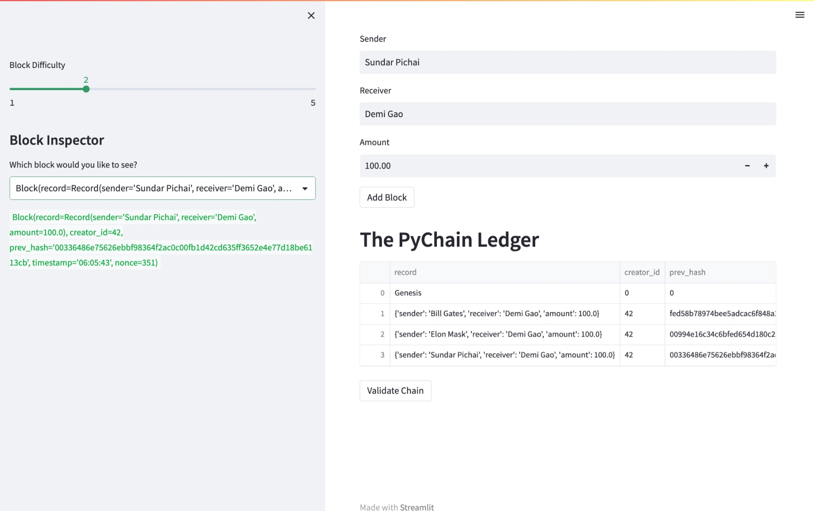
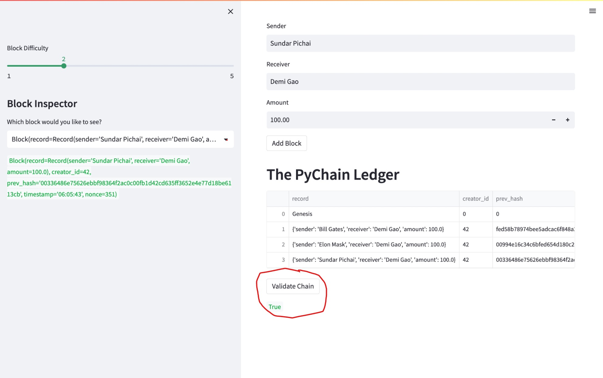

# Building a Blockchain-based Ledger System

This project is designed to build a blockchain-based ledger system that allows users to store transaction records.

## Technologies

The project uses the following technologies:

This project was created using the following technologies:

- Python programming language (version 3.9.7)
- Streamlit (version 1.20.0) for building the user interface
- dataclasses module for creating classes to represent data objects
- typing module for type hints in function signatures and variables
- datetime module for working with dates and times
- pandas library (version 1.5.3) for data manipulation and analysis
- hashlib module for working with hashes

## Installation Guide

1. Clone the repository from GitHub:

    ```
    git clone https://github.com/Demigodgeek/C18_blockchain_based_ledger_system.git
    ```

2. Install the required Python libraries:

    ```
    pip install streamlit pandas hashlib
    ```

    Note: if you're not using a virtual environment, you may need to use `pip3` instead of `pip`.

## Usage

To use the PyChain ledger, follow these steps:

1. In the terminal, navigate to the project folder `C18_blockchain_based_ledger_system`
2. In the terminal, run the Streamlit application by using `streamlit run pychain.py`.
3. Enter values for the sender, receiver, and amount, and then click the "Add Block" button. Do this several times to store several blocks in the ledger.
4. Verify the block contents and hashes in the Streamlit drop-down menu.  

5. Test the blockchain validation process by using the web interface.  


## Contributors

- Demi Gao

## License

This project is licensed under the [MIT License](https://opensource.org/licenses/MIT).